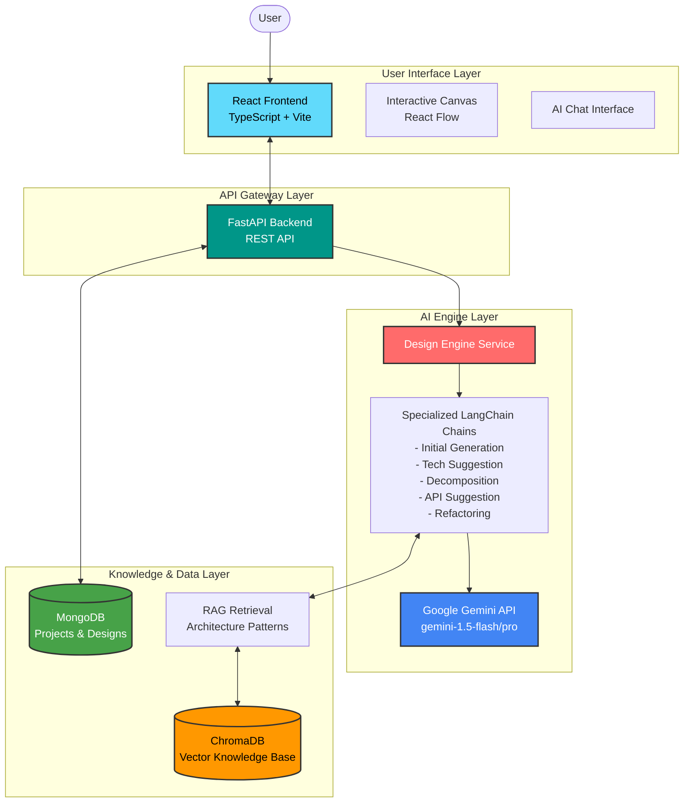
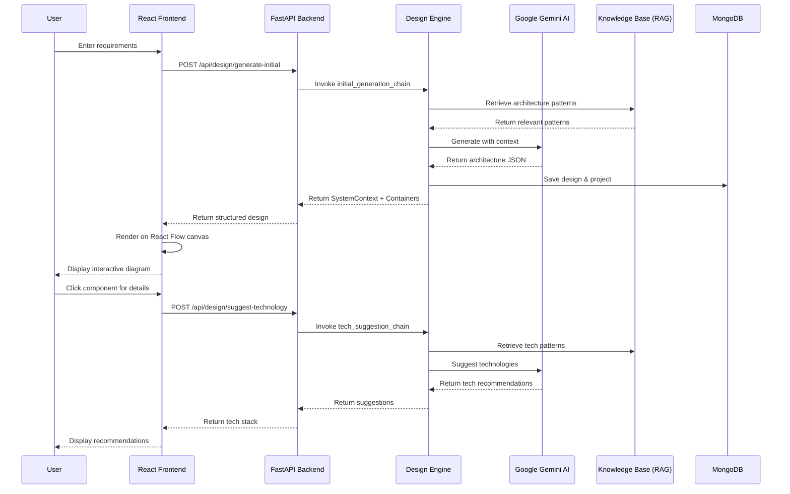
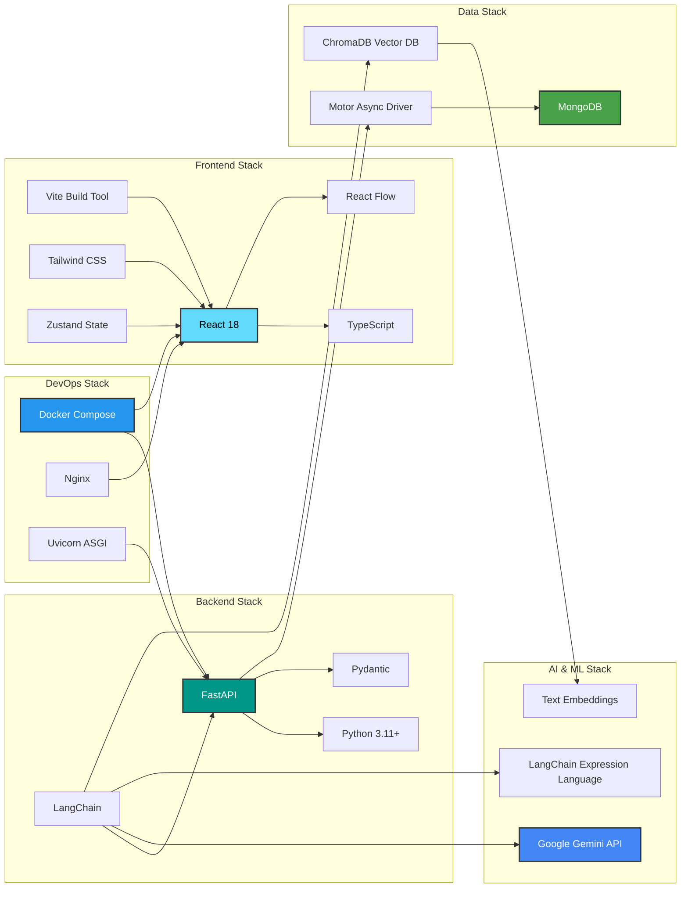
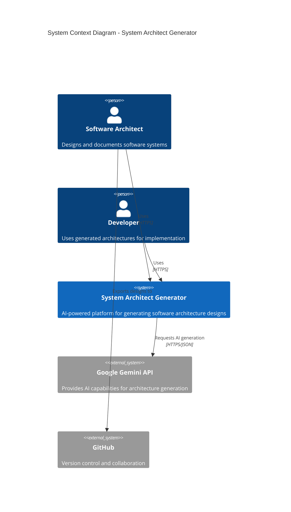
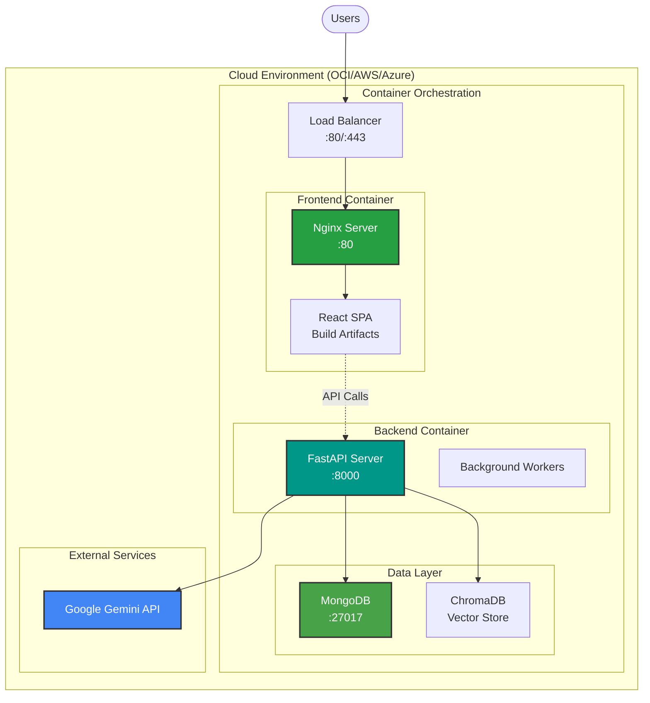

# System Architect Generator - 2-Minute Video Script

## 📹 Video Script (120 seconds)

### [0:00-0:15] Opening Hook (15s)
**Visual**: Animated logo reveal, then show a developer looking frustrated at architecture diagrams

**Voiceover**: 
> "Designing software architecture is complex, time-consuming, and requires deep expertise. What if AI could help you generate professional-grade system architectures in minutes? Meet the **System Architect Generator** - your AI-powered architecture assistant."

---

### [0:15-0:35] Problem & Solution (20s)
**Visual**: Split screen - left shows traditional manual architecture process (messy, time-consuming), right shows our clean automated process

**Voiceover**: 
> "Traditional architecture design involves manual diagramming, inconsistent documentation, and weeks of iteration. Our system changes that. Simply describe your requirements in plain English, and watch as AI generates complete C4 model architectures with system context, containers, components, and technology recommendations."

---

### [0:35-0:70] Key Features Demo (35s)
**Visual**: Screen recording of the application in action

**Voiceover**: 
> "Here's how it works:
> 
> **First**, enter your project requirements through our intuitive chat interface. 
> 
> **Second**, our AI engine, powered by Google Gemini and backed by a comprehensive knowledge base, analyzes your needs and generates a complete architecture following the C4 model.
> 
> **Third**, visualize your architecture on our interactive canvas built with React Flow. Click any component to explore details, request technology suggestions, decompose containers into components, or refactor elements.
> 
> **Finally**, our RAG-powered AI assistant provides intelligent recommendations, pulling from architecture patterns and best practices stored in our vector database."

---

### [0:70-0:95] Technology Stack & Architecture (25s)
**Visual**: Animated architecture diagram (see below)

**Voiceover**: 
> "The system is built on a modern tech stack: A React TypeScript frontend with Zustand state management and React Flow for visualization. The FastAPI backend integrates LangChain with Google Gemini for AI operations, MongoDB for data persistence, and ChromaDB for vector-based knowledge retrieval. Everything runs seamlessly in Docker containers, ready to deploy to the cloud."

---

### [0:95-0:115] Benefits & Use Cases (20s)
**Visual**: Icons/animations showing different use cases

**Voiceover**: 
> "Perfect for software architects starting new projects, development teams standardizing their approach, or enterprises scaling their architecture practices. Reduce design time from weeks to hours, ensure consistency across projects, and leverage AI-powered insights from proven patterns."

---

### [0:115-0:120] Call to Action (5s)
**Visual**: GitHub repo page, documentation links, logo

**Voiceover**: 
> "Ready to transform your architecture process? Check out our GitHub repository and start building smarter. System Architect Generator - Architecture, Automated."

---

## 🎨 Visual Elements & Transitions

### Scene Breakdown:
1. **Hook**: Dark background → Bright reveal (0-15s)
2. **Problem/Solution**: Side-by-side comparison with smooth transition (15-35s)
3. **Demo**: Full-screen application recording with highlights (35-70s)
4. **Architecture**: Animated diagram with element highlights (70-95s)
5. **Benefits**: Fast-paced montage with icons (95-115s)
6. **CTA**: Clean, professional end screen (115-120s)

---

## 🏗️ Architecture Diagrams for Video

### Diagram 1: High-Level System Architecture

### Diagram 2: User Workflow & Data Flow

### Diagram 3: Technology Stack

### Diagram 4: Component Architecture (C4 Model - System Context)

### Diagram 5: Deployment Architecture

---

## 🎬 Production Notes

### Visual Style
- **Color Scheme**: Modern tech colors (blues, greens, purples)
- **Animation Style**: Smooth, professional transitions
- **Typography**: Clean sans-serif fonts (Inter, Roboto)
- **Pacing**: Dynamic but not rushed

### Audio
- **Voiceover**: Professional, enthusiastic but not overly energetic
- **Background Music**: Subtle tech-oriented ambient music
- **Sound Effects**: Minimal, only for key transitions

### Key Highlights to Show
1. Chat interface with requirement input
2. Real-time architecture generation
3. Interactive canvas manipulation
4. Node detail drawer with actions
5. Technology suggestions appearing
6. Container decomposition animation

### B-Roll Footage Ideas
- Developers working on architecture diagrams (traditional way)
- Zoom into code/terminal showing deployment
- Quick cuts of different architecture patterns
- Happy developers reviewing generated designs

---

## 📊 Key Metrics to Display (Optional Overlay)

- **Design Time**: "From weeks to hours"
- **Components Supported**: "System Context, Containers, Components, Code"
- **AI Models**: "Google Gemini 1.5 Flash/Pro"
- **Deployment**: "Docker-ready, cloud-native"

---

## 🔗 Resources & Links

### For Video Description
- **GitHub**: `https://github.com/devinda0/system-architect-generator`
- **Documentation**: Link to docs folder
- **Quick Start**: Link to QUICKSTART.md
- **Live Demo**: (If available)

### Hashtags
`#SoftwareArchitecture #AI #MachineLearning #C4Model #FastAPI #React #LangChain #GoogleGemini #DevTools #SoftwareEngineering`

---

## 📝 Script Variations

### 30-Second Version (Social Media)
> "Tired of spending weeks on software architecture? System Architect Generator uses AI to create professional C4 model diagrams in minutes. Describe your needs, get instant architecture, refine with AI assistance. Built with React, FastAPI, and Google Gemini. Transform your workflow today!"

### 60-Second Version (Product Demo)
> "System Architect Generator is an AI-powered tool that revolutionizes software design. Enter requirements, generate complete C4 architectures, visualize on interactive canvas, and get intelligent recommendations from our RAG-powered knowledge base. Built for architects and developers who want speed without sacrificing quality. Modern tech stack with React, FastAPI, and Google Gemini. Start designing smarter today!"

---

**Version**: 1.0  
**Last Updated**: November 8, 2025  
**Target Duration**: 120 seconds (2 minutes)  
**Format**: 16:9 landscape, 1080p minimum  
**Intended Platforms**: YouTube, LinkedIn, Product Landing Page
